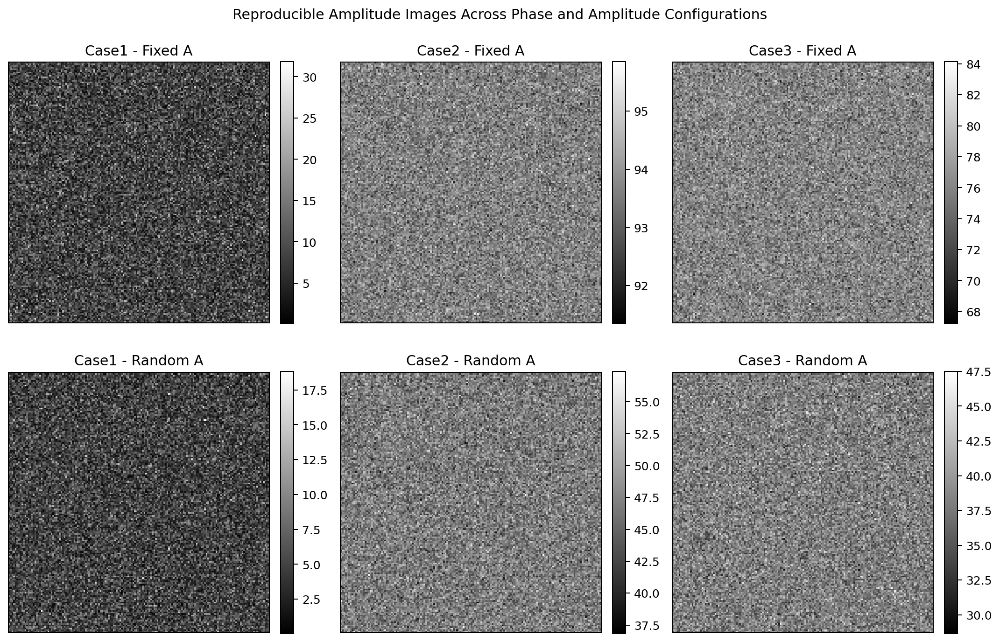
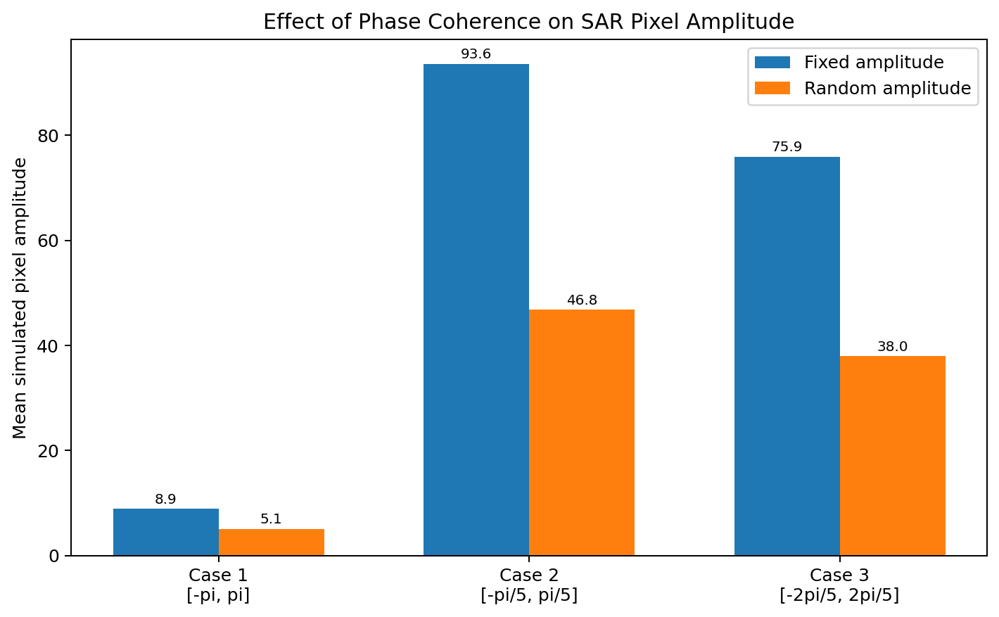
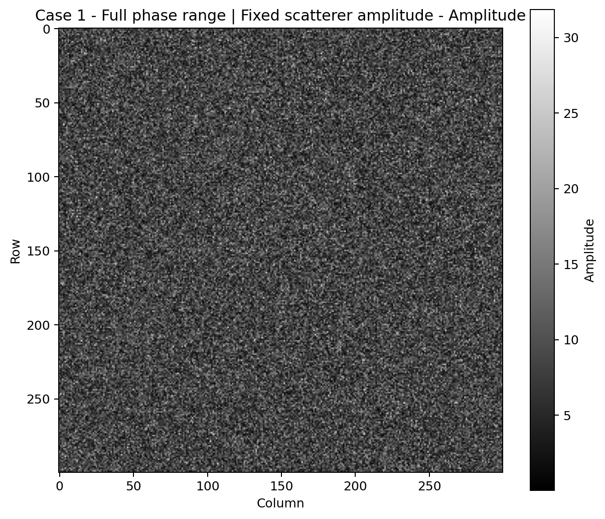
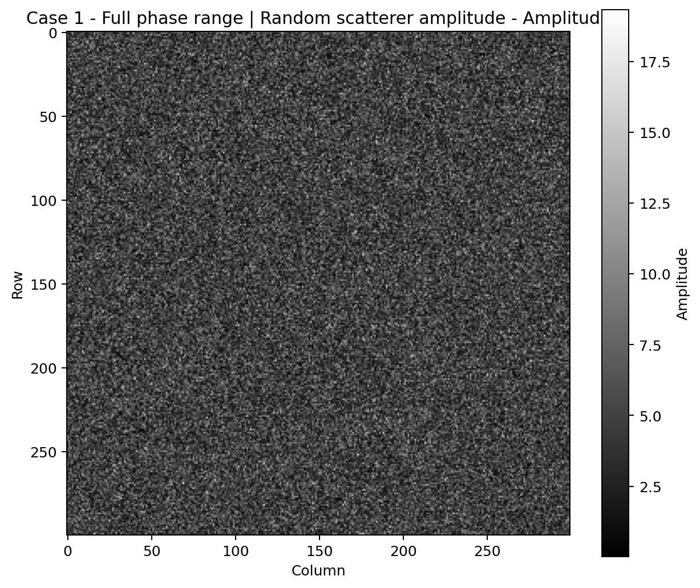
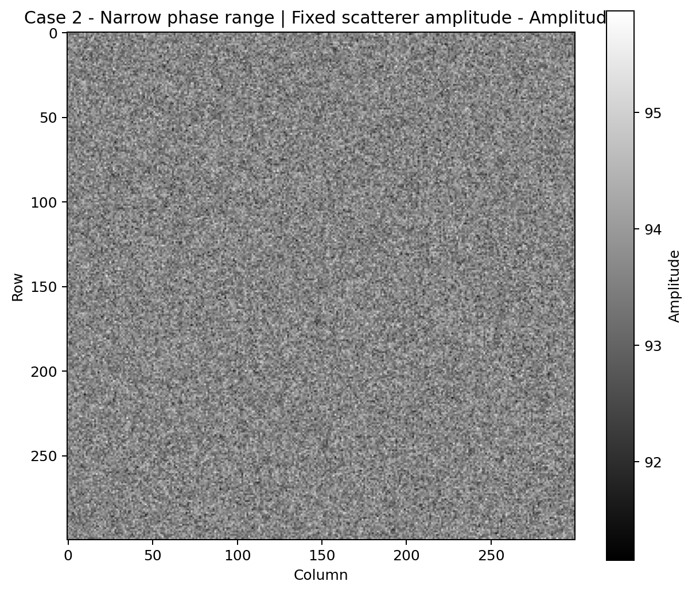
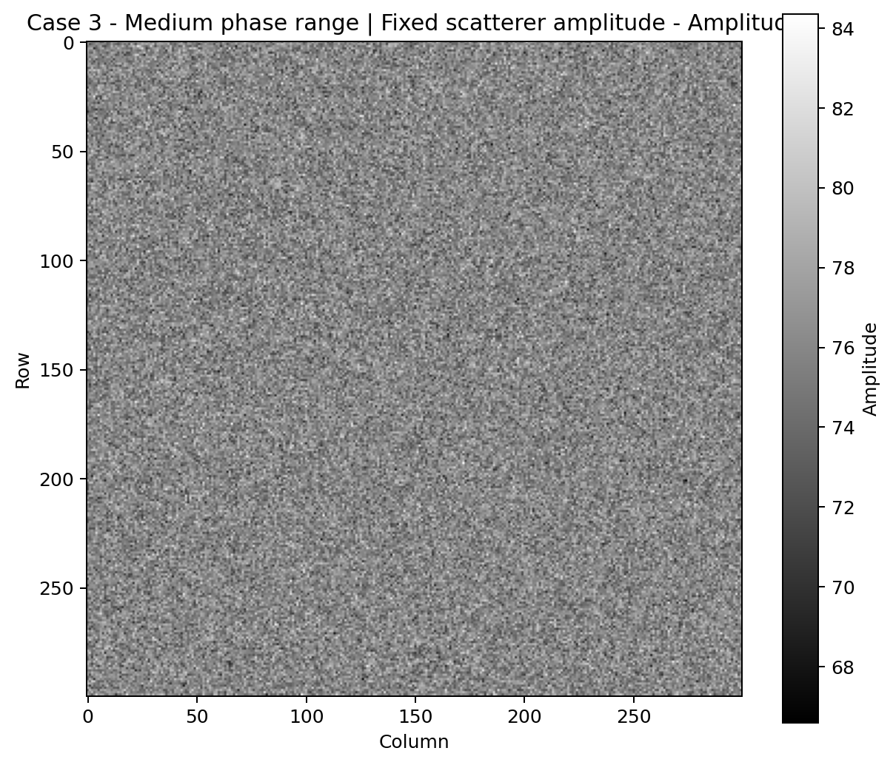

# SAR Point-Scatterer Image Formation Simulation

A reproducible Python simulation of **Synthetic Aperture Radar (SAR) image formation** from coherent point scatterers.

Each image pixel is modeled as the complex sum of **100 independent scatterers**, allowing the effect of **phase coherence** and **scatterer-amplitude variability** on SAR amplitude, phase, and speckle-like behavior to be explored.

The project originated from graduate coursework in **Radargrammetry** at K. N. Toosi University of Technology and was refactored into a clean, tested, portfolio-ready Python package.

## Core Model

For each scatterer:

```text
s_i = A_i exp(j phi_i)
```

For each pixel:

```text
S = sum_i s_i
Amplitude = |S|
Phase = arg(S)
```

The documented coursework configuration uses:

```text
image size             = 300 x 300 pixels
scatterers per pixel   = 100
```

## Experimental Cases

| Case | Scatterer phase range | Physical behavior |
| --- | --- | --- |
| Case 1 | `[-pi, pi]` | Fully dispersed phase; strongest constructive/destructive mixing |
| Case 2 | `[-pi/5, pi/5]` | Narrow phase range; strong coherence and high final amplitude |
| Case 3 | `[-2pi/5, 2pi/5]` | Intermediate coherence between Cases 1 and 2 |

Each case is evaluated with two amplitude models:

- **Fixed amplitude:** `A_i = 1`
- **Random amplitude:** `A_i ~ Uniform(0, 1)`

## Reproducible Amplitude Comparison

The refactored simulator generates all six combinations using fixed random seeds.



The narrow phase interval in Case 2 creates a much stronger coherent sum, while Case 1 exhibits the lowest mean amplitude because the scatterer phases span the full `[-pi, pi]` interval.



## Example Outputs

### Case 1 - Full Phase Range

**Fixed scatterer amplitude**



**Random scatterer amplitude**



### Case 2 - Narrow Phase Range



### Case 3 - Medium Phase Range



Phase figures for all configurations are also included in `figures/`.

## Why the Phase Range Matters

For a uniform phase distribution `phi ~ Uniform(-a, a)`,

```text
E[exp(j phi)] = sin(a) / a
```

This gives a direct explanation for the experiment:

- Case 1 (`a = pi`) has zero coherent phasor mean.
- Case 2 (`a = pi/5`) has the strongest coherent component.
- Case 3 (`a = 2pi/5`) lies between them.

Randomizing `A_i` changes the magnitude statistics while preserving the same phase-range structure.

## Refactor Improvements

The public version fixes several problems in the original coursework scripts:

- consolidates six duplicated scripts into one reusable simulation module;
- corrects inconsistent Case 1/2/3 naming;
- generates correct plot titles automatically;
- removes hard-coded local Windows paths;
- replaces implicit global randomness with explicit reproducible seeds;
- replaces nested per-pixel Python loops with chunked NumPy vectorization;
- adds unit tests for the expected ordering of the three phase-coherence regimes;
- keeps all public source code, comments, filenames, and documentation in English.

## Run All Six Configurations

```bash
pip install -r requirements.txt
python examples/run_all_cases.py --output-dir outputs
```

Optional parameters:

```bash
python examples/run_all_cases.py \
  --rows 300 \
  --cols 300 \
  --scatterers 100 \
  --seed 42 \
  --output-dir outputs
```

## Run a Single Case

```bash
python examples/run_single_case.py \
  --case case2 \
  --amplitude random \
  --seed 42 \
  --output-dir outputs
```

## Tests

```bash
python -m unittest discover -s tests
```

The tests verify:

- deterministic reproducibility;
- output dimensions;
- correct phase ranges;
- expected amplitude ordering between full, medium, and narrow phase ranges;
- expected reduction of the coherent component for random amplitudes;
- finite image statistics.

## Repository Structure

```text
sar-point-scatterer-image-simulation/
├── README.md
├── LICENSE
├── requirements.txt
├── pyproject.toml
├── .gitignore
├── src/
│   └── sar_scatterer_sim/
│       ├── __init__.py
│       ├── model.py
│       └── plotting.py
├── examples/
│   ├── run_all_cases.py
│   └── run_single_case.py
├── tests/
│   └── test_model.py
├── data/
│   └── reproducible_statistics.csv
├── figures/
│   ├── amplitude_case_grid.png
│   ├── mean_amplitude_comparison.png
│   ├── case1_fixed_amplitude.png
│   ├── case1_fixed_phase.png
│   ├── case1_random_amplitude.png
│   ├── case1_random_phase.png
│   ├── case2_fixed_amplitude.png
│   ├── case2_fixed_phase.png
│   ├── case2_random_amplitude.png
│   ├── case2_random_phase.png
│   ├── case3_fixed_amplitude.png
│   ├── case3_fixed_phase.png
│   ├── case3_random_amplitude.png
│   └── case3_random_phase.png
└── docs/
    ├── mathematical_model.md
    └── refactor_notes.md
```

## Research Relevance

This project demonstrates experience with:

- SAR image-formation fundamentals
- coherent complex-signal summation
- speckle-like amplitude behavior
- phase statistics
- Monte Carlo simulation
- complex-valued numerical computing
- vectorized NumPy workflows
- reproducible scientific Python

It complements broader work in **radargrammetry, remote sensing, photogrammetry, and geospatial signal processing**.

## Author

**Reza Pourali**  
M.Sc. Student in Photogrammetry  
K. N. Toosi University of Technology
